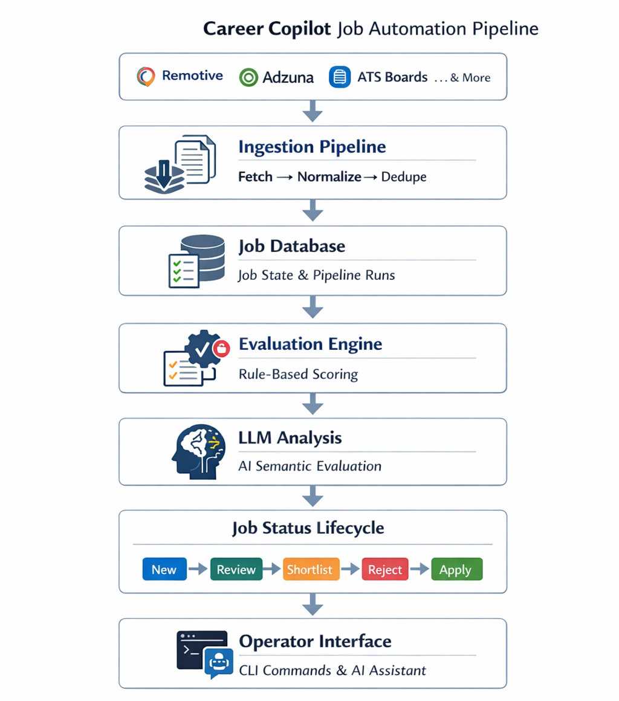

# Career Copilot

Career Copilot is an AI-assisted job search operator tool.

It runs a continuous pipeline that ingests remote job listings from 14 sources, scores and filters them against a candidate profile, and surfaces the best matches for human review. The operator interacts with the system through a CLI control surface and a natural language assistant backed by live database access — not a chat interface bolted onto a scraper, but a workflow system with stats, triage queues, shortlists, pipeline control, and ATS-aware application automation.

> **Live dataset** — 1,100+ jobs ingested · 14 active sources · 333 pipeline runs · automated deduplication across all sources

---

## Why This Project Exists

Job searching at scale means manually scanning hundreds of postings across dozens of sites, filtering roles that are geographically restricted or off-target, and tracking applications before they go cold.

Career Copilot explores how much of this workflow can be automated through a combination of data pipelines, deterministic evaluation, and local LLM reasoning — while keeping the operator in control of every decision that matters.

The goal is not to automate applying. It is to eliminate the mechanical work that precedes it: discovery, filtering, scoring, and triage. By the time a job reaches the shortlist, it has already passed geographic eligibility checks, rule-based fit scoring, and semantic LLM evaluation. The operator's attention is reserved for jobs that have earned it.

---

## System Architecture



The Career Copilot pipeline discovers jobs from multiple sources, stores them in a local database, evaluates fit using deterministic rules and LLM reasoning, and exposes the results through a CLI workflow and natural-language assistant.

---

## Key Features

- Multi-source job ingestion from 15 sources (job boards + direct ATS APIs)
- Job deduplication and normalization across all sources
- Remote eligibility classification with geographic pattern detection
- Rule-based fit scoring (skill overlap, seniority, title relevance)
- Local LLM reasoning via Ollama — structured outputs, fit explanation, skill gaps
- Persistent job lifecycle tracking (new → review → shortlisted → applied)
- Natural language assistant with live database access and tool calling
- Resume recommendation engine — best resume selected per job from tagged profiles
- ATS detection and Playwright-powered form prefill (Greenhouse, Lever, Ashby, Workable)
- Scheduled automation via Windows Task Scheduler
- Email digest reports after each pipeline run

---

## Decision Architecture

Each job passes through three independent decision layers. The layered design reflects a deliberate engineering choice: deterministic filters handle objective criteria cheaply and fast, the LLM handles semantic ambiguity, and the human operator handles judgment calls that neither layer should make alone.

```
Layer 1 — Deterministic filters
  remote eligibility    geographic pattern matching, US-only rejection, region acceptance
  role relevance        title keyword matching against target roles
  seniority alignment   preferred and acceptable levels from profile
  skill overlap         matched skills and domain keywords from job description
        ↓
Layer 2 — LLM semantic evaluation  (local Ollama, no data leaves the machine)
  semantic fit          job description evaluated against full candidate profile
  structured output     JSON: fit score, strengths, skill gaps, recommendation
  conservative updates  only promotes or rejects from review; never overwrites manual decisions
        ↓
Layer 3 — Human review
  shortlisted           strong fit, ready to apply
  review                borderline; human decides
  rejected              poor fit or location mismatch
  applied               submitted; tracked in application history
```

This hybrid architecture avoids the two failure modes of pure-ML systems (opaque decisions) and pure rule systems (missed semantic matches).

---

## Natural Language Assistant

> **`python run_pipeline.py ask`**

Career Copilot includes a local AI assistant that operates on the live system using natural language. It uses tool calling to query the real database and pipeline history — it never guesses or makes up data.

**Example interactions:**

```
You: how many shortlisted jobs do I have?
  → count_jobs_by_status(status="shortlisted")
Assistant: You currently have 3 shortlisted jobs.

You: what should I apply to next?
  → get_top_shortlisted_jobs(limit=5)
Assistant: Your top shortlisted job is Sr. ML Engineer at Anthropic
          (fit score: 87, LLM confidence: 91%). Recommended resume: gpu_systems.

You: what happened in the last pipeline run?
  → get_recent_runs(limit=1)
Assistant: The last run completed at 12:00 today. It fetched 349 jobs,
          33 of which were new. Outcome: success.

You: when does the pipeline run automatically?
  → get_schedule()
Assistant: The pipeline is scheduled at 8:00 AM, 12:00 PM, 4:00 PM,
          and 8:00 PM daily. Next run: today at 16:00.
```

Available tools:

| Tool | What it answers |
|---|---|
| `count_jobs_by_status` | "how many shortlisted jobs do I have?" |
| `get_jobs_by_status` | "show me my review jobs" |
| `get_top_jobs` | "what are my best matches?" |
| `get_top_shortlisted_jobs` | "what should I apply to next?" |
| `get_jobs_needing_review` | "what's in my triage queue?" |
| `search_jobs` | "do I have any jobs at Anthropic?" |
| `get_job_detail` | "tell me more about job 42" |
| `get_job_description` | "show me the full description for job 42" |
| `get_pipeline_stats` | "how many jobs are in the system?" |
| `get_recent_runs` | "did the last run succeed?" |
| `get_schedule` | "when does the pipeline run automatically?" |

---

## Local AI Reasoning

Career Copilot uses [Ollama](https://ollama.com) for fully local inference — no API costs, no data leaving your machine.

Tested models:

- `qwen2.5:7b` (default — good tool calling support)
- `llama3.1`
- `mistral`

The LLM layer produces structured JSON outputs with defined schemas. Malformed or failed responses do not break the pipeline — the job remains in review.

---

## Job Sources

| Source | Type | Notes |
|---|---|---|
| [Remotive](https://remotive.com) | JSON API | General remote tech jobs |
| [Arbeitnow](https://www.arbeitnow.com) | JSON API | European-focused remote jobs |
| [Jobicy](https://jobicy.com) | JSON API | Remote tech jobs |
| [Jobspresso](https://jobspresso.co) | RSS | Curated remote jobs |
| [Dynamite Jobs](https://dynamitejobs.com) | RSS | Remote-first jobs |
| [GetOnBoard](https://www.getonbrd.com) | JSON API | Tech jobs, LatAm-focused (fully remote only) |
| [Himalayas](https://himalayas.app) | JSON API | Worldwide-only remote jobs |
| [RemoteOK](https://remoteok.com) | JSON API | Remote jobs — only jobs with extractable ATS links |
| [WeWorkRemotely](https://weworkremotely.com) | RSS | Curated remote tech jobs |
| [Adzuna](https://www.adzuna.com) | JSON API | Multi-country (gb/de/fr/nl/at/be/au/ca), remote-filtered |
| Direct ATS | Multi-API | Curated company list from `profile.yaml` — auto-detects [Ashby](https://ashbyhq.com) / [Greenhouse](https://greenhouse.io) / [Lever](https://lever.co) / [Workable](https://workable.com) |
| Ashby | JSON API | DB-discovered Ashby boards not already in Direct ATS |
| Greenhouse | JSON API | DB-discovered Greenhouse boards not already in Direct ATS |
| Lever | JSON API | DB-discovered Lever boards not already in Direct ATS |
| [Working Nomads](https://www.workingnomads.com) | JSON API | Disabled by default (Proxify approval required) |

Jobs older than 10 days are filtered out at fetch time across all sources.

---

## Pipeline

```
full-run
  │
  ├─ FETCH        Pull from all sources → normalize → deduplicate → store
  │
  ├─ EVALUATE     Rule-based scoring against your profile
  │                 remote eligibility · skill overlap · seniority · title relevance
  │                 → status: shortlisted / review / rejected
  │
  └─ ANALYZE      Local LLM (Ollama) pass on review jobs
                    → promotes to shortlisted or rejects with explanation
```

**Example workflows:**

```powershell
# Run the full pipeline
python run_pipeline.py full-run

# Full run with email digest
python run_pipeline.py full-run --email

# Work through the review queue interactively
python run_pipeline.py triage

# Open and prefill an application form
python run_pipeline.py open-job

# Launch the natural language assistant
python run_pipeline.py ask
```

---

## Command Reference

Run `python run_pipeline.py help` for the full reference. Key commands:

| Command | What it does |
|---|---|
| `full-run` | Fetch + evaluate + LLM analyze in one shot |
| `full-run --email` | Same, plus email digest if new jobs found |
| `triage` | Work through review jobs: shortlist / reject / open / skip |
| `open-job` | Open a shortlisted job in browser with form prefill |
| `ask` | Start the interactive LLM assistant |
| `stats` | Job counts by status |
| `shortlist` | List shortlisted jobs |
| `review` | List review jobs |
| `rescore` | Re-apply scoring rules to existing review jobs |
| `setup-credentials` | Store email credentials in Windows Credential Manager |

---

## Setup

### 1. Install dependencies

```powershell
pip install -r requirements.txt
playwright install chromium
```

### 2. Configure your profile

Copy `profile.template.yaml` to `profile.yaml` and fill in your details:

```yaml
skills:          # matched against job titles and descriptions
keywords:        # domain-specific terms (gpu, llm, inference, etc.)
target_roles:    # role titles you're targeting
seniority:       # preferred and acceptable levels
blacklisted_companies:
target_companies:  # curated list with careers_url — ATS auto-detected
preferences:
  remote_only: true
  accepted_regions: [worldwide, emea, europe, canada, ...]
  reject_regions: [us only]
  contractor_ok: true
resumes:         # multiple resumes with tags — best match selected per job
```

### 3. Set up Ollama

Install [Ollama](https://ollama.com) and pull a model:

```powershell
ollama pull qwen2.5:7b
```

Verify it is running:

```powershell
ollama list          # should show qwen2.5:7b in the list
ollama run qwen2.5:7b "say hello"   # quick smoke test
```

If the model is missing or Ollama isn't responding, common fixes:

| Symptom | Fix |
|---|---|
| `ollama: command not found` | Restart your terminal after installing Ollama |
| `connection refused` on port 11434 | Run `ollama serve` in a separate terminal, or check the Ollama tray icon |
| `model not found` | Run `ollama pull qwen2.5:7b` again |
| Slow or no response | The model is loading — wait ~30 seconds on first run |
| Want a faster/smaller model | `ollama pull qwen2.5:3b` and update `OLLAMA_MODEL` in `.env` |

**Once Ollama is set up, you can use the built-in assistant for any further troubleshooting:**

```powershell
python run_pipeline.py ask
```

### 4. (Optional) Configure email reports

```powershell
python run_pipeline.py setup-credentials
```

Credentials are stored in Windows Credential Manager — never written to disk.

Copy `.env.example` to `.env` and set `EMAIL_SMTP_HOST` / `EMAIL_SMTP_PORT` if needed (defaults to Gmail).

### 5. (Optional) Schedule automated runs

`schedule_run.bat` is pre-configured to run `full-run --email`. Register it with Windows Task Scheduler.

The default schedule runs at 8am, 12pm, 4pm, and 8pm daily.

---

## Application Assistance

`open-job` opens a job in a Playwright browser window and:

1. Navigates to the application form
2. Detects the ATS (Greenhouse, Lever, Ashby, etc.)
3. Prefills fields from your profile (name, email, phone, LinkedIn, GitHub)
4. Attempts to upload the best-matched resume
5. Waits for your review — **you submit manually**
6. Prompts you to mark the job as `applied`

Bot-protected sites (remoteok.com, weworkremotely.com, jobicy.com) open in your system browser without prefill.

---

## Design Principles

**Privacy First** — All LLM processing runs locally via Ollama. No job data or profile information is sent to external AI services.

**Human in the Loop** — No application is submitted automatically. Every submission requires your explicit approval.

**Grounded assistant** — The natural language assistant uses tool calling to query real data. It never generates numbers or statuses from inference alone.

**Assistive, not blind** — The pipeline reduces mechanical work (searching, filtering, form filling) while you make the final calls.

---

## Glossary

| Term | Definition |
|---|---|
| **ATS** | Applicant Tracking System — software companies use to manage job postings and applications (e.g. Greenhouse, Lever, Ashby, Workable) |
| **DB** | Database — the local SQLite file that stores all fetched jobs and their evaluation state |
| **EMEA** | Europe, Middle East and Africa — a common geographic region grouping used in job postings |
| **JSON API** | An HTTP endpoint that returns structured data in JSON format |
| **LatAm** | Latin America |
| **LLM** | Large Language Model — an AI model used here via Ollama to semantically evaluate job fit |
| **Ollama** | A local LLM runtime that runs models on your own machine — no data sent to external services |
| **RSS** | Really Simple Syndication — a feed format used by some job boards to publish listings |
| **SMTP** | Simple Mail Transfer Protocol — the standard used to send email reports |
| **YAML** | A human-readable configuration file format — used for `profile.yaml` |
